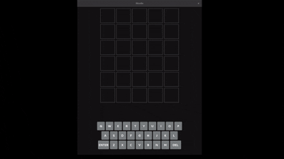

# Flet Wordle Clone 🟩

A simple, lightweight Wordle clone built entirely in Python with the [Flet](https://flet.dev) framework.


## ✨ Features

* Classic 5-letter, 6-guess Wordle gameplay.
* Fully responsive UI that works on desktop and web.
* An interactive on-screen keyboard that updates with tile colors.
* Clean, modular code that is easy to understand and modify.

## 💻 Tech Stack

* **Python 3**
* **Flet** (for the entire user interface)

## 🚀 Getting Started

Follow these steps to get the game running on your local machine.

### Prerequisites

* Python 3.8 or newer

### Installation & Running

1. **Clone the repository:**

    ```sh
    git clone https://github.com/fazeisfaze/Wordle_Clone.git
    ```

2. **Navigate to the project directory:**

    ```sh
    cd Wordle_Clone
    ```

3. **Install the required dependencies:**

    ```sh
    pip install -r requirements.txt
    ```

4. **Run the app:**

    ```sh
    flet run
    ```

    *(For hot reload, which automatically updates the app as you code, use `flet run -r`)*

## 🎮 How to Play

1. Type your 5-letter guess and press Enter.
2. The tiles will change color to give you clues:
    * 🟩 **Green:** The letter is in the word and in the correct spot.
    * 🟨 **Yellow:** The letter is in the word but in the wrong spot.
    * ⬛ **Gray:** The letter is not in the word in any spot.
3. You have 6 tries to guess the secret word. Good luck!

## 🤝 Contributing

Contributions, issues, and feature requests are welcome! Feel free to check the [issues page](https://github.com/fazeisfaze/Wordle_Clone/issues) or submit a pull request.

## 📄 License

This project is licensed under the MIT License - see the `LICENSE` file for details.
